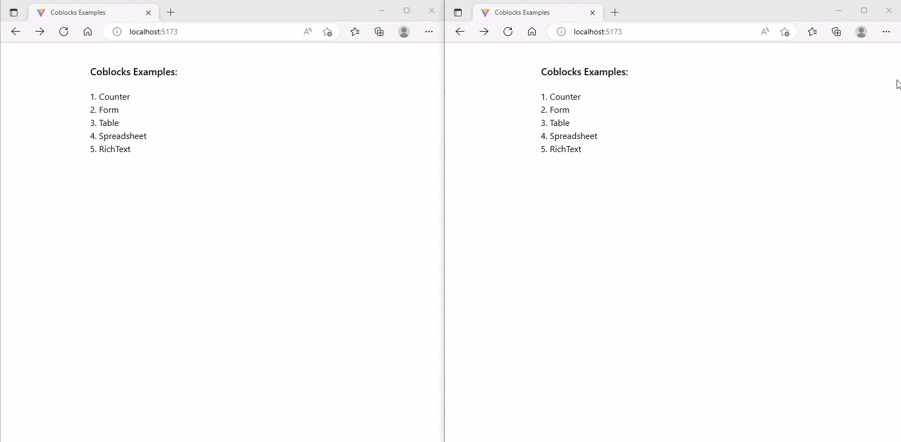

# Coblocks

Open-source implementation of `Collaborative Blocks`, based on [Y.js](https://github.com/yjs/yjs).

[](./LICENSE.md)

**Note1:** This is a work in progress. Use at your own risk.

**Note2:** `Coblocks` forked from [hocuspocus.dev](https://www.hocuspocus.dev).

`hocuspocus` is a excellent backend server for `Y.js`, but it has some drawbacks that prevent it from fully meeting real-world scenarios:

- Update performance issues: every update event requires a full table update.
- Data loss issues: there is no local storage, and WebSocket communication is not stable enough, with no synchronization status indication, leading to data loss.
- Not user-friendly enough: the coverage of business scenarios is not wide enough.
- Communication protocol not easily observable: the pure binary, while secure, makes it impossible to troubleshoot problems.
- Other various reasons..."

## Documentation

The full documentation is a available on [hocuspocus.dev/introduction](https://www.hocuspocus.dev/introduction), **but it's `hocuspocus` only**.

## TODO

See [TODO.md](./TODO.md).

## Start From Local

Run playground:

```bash
$ npm install
$ npm run start
```

Unit test:

```bash
$ docker-compose up -d
$ npm run test
```

## Examples

### Counter、Form、Table


### Rich Text、Spreadsheet



## Contributing

Please see [CONTRIBUTING](docs/contributing.md) for details.

## Contributors

[kris](https://github.com/kriskbx) (who wrote the initial version), [Tom Moor](https://github.com/tommoor), [YousefED (@TypeCellOS)](https://github.com/YousefED) and [many more](../../contributors).

## License

The MIT License (MIT). Please see [License File](LICENSE.md) for more information.
