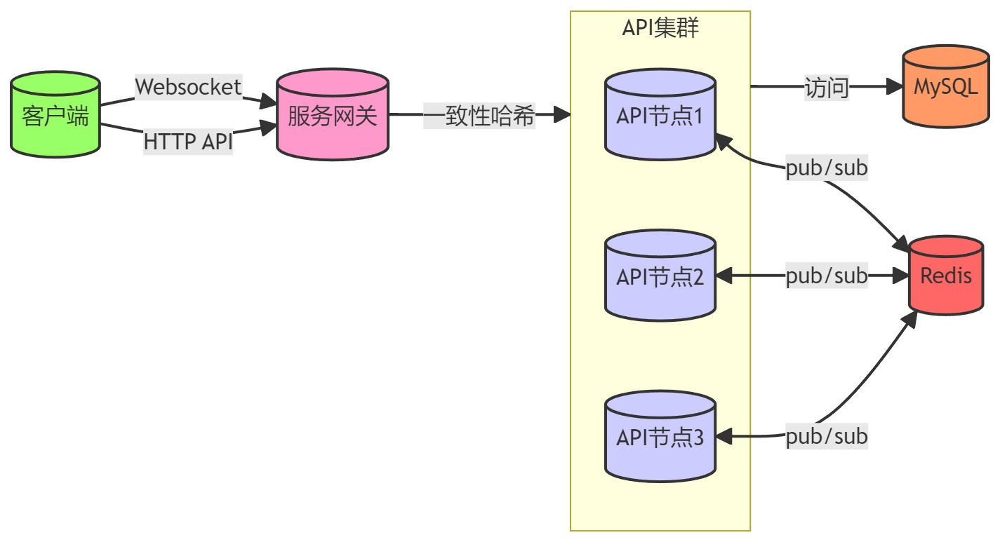

# Introduction

collaborative blocks 同步块

易用，高效的协同平台

## 要点

要做什么：

- 协同平台原型；
  - 上手门槛低，易用，高效；

不要做什么：

- 过多优化：
  - 过早引入分库分表；
  - 过早引入微服务拆分；
  - 过早优化性能导致功能被阉割；

## 整体架构

### 业务架构

- project 是管理 room 的集合，用户可以创建 project，以及 room；
- client 端无需登录，而是使用 api key 访问，api key 由 project 颁发；
- room 是核心实体，触发 hooks，并下面有 3 类实体：
  - 文档：保存核心数据内容，如 richtext，list，map，comments 等等；
  - 元数据：自定义数据，方便扩展；
  - 权限：room 访问权限，分为无、只读、读写三种；
- 申请 api key 时，可以指定 room，权限等；

### 技术架构

**前端**

**后端**

**数据实体设计**

见[coblocks](../app/coblocks.sql)

## 同步协议

### 客户端-服务端

两种数据同步协议：

- 步进式：
  - 由客户端发起，发起时机有两种：
    1. 客户端建连；
    2. 定时器强制发起；
  - 客户端发起 step1，发送本地文档的 state vector；
  - 服务端收到 step1 后，先发送服务端文档的 state vector，即 step1；
  - 随后处理客户端 state vector，对比服务端文档，发送 step2，即 update 数据；
  - 客户端收到 step1后，对比本地文档，发送 step2；
  - 服务端收到 step2，双方更新数据完毕，发送 synced 告知客户端更新完毕；
- 增量式：
  - 客户端文档发送更新，客户端发送 update 消息，包含文档事务更新数据；
  - 服务端收到 update 后，应用到服务端文档，回复 synced 信息告知客户端更新完毕；

### 订阅-发布

服务器集群节点之间通过 Redis pub/sub 来实现 doc，awareness 通信：

- doc：
  - 节点加载文档到内存后，或者服务器节点文档变更时发布 step1 到 redis；
  - 其它节点订阅到 step1 时，拿到 state vector 发布 step2；
  - 节点收到 step2，应用到节点文档；
  - 无 synced 消息；
- awareness query：
  - 加载文档到内存，发布 awareness 请求；
  - 其它节点回复 awareness 结果；
  - 收到 awareness 并应用；
- awareness：
  - awareness 变化时，发布 awareness；
  - 其它节点收到 awareness，应用；

## 参考资料

- https://docs.nestjs.com/
- https://liveblocks.io/
- https://tiptap.dev/hocuspocus/introduction
- https://www.prisma.io/
- https://chakra-ui.com/getting-started
- https://chakra-templates.dev/
